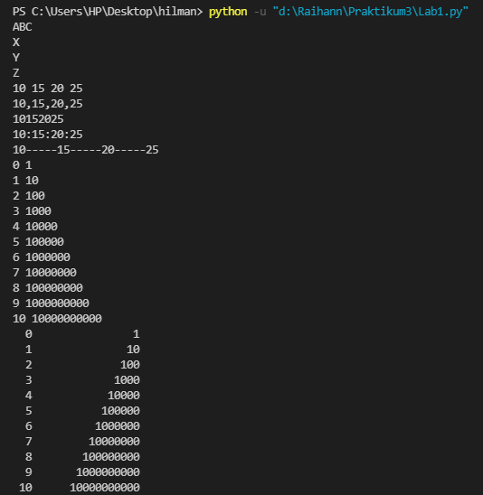
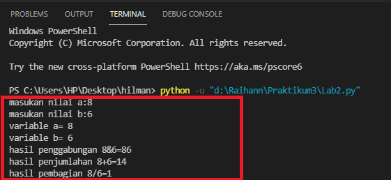

# Praktikum2
## Tugas Pertemuan 6 - Bahasa Pemrograman

### 1. File program menghitung luas dan keliling lingkaran
**Flowchart untuk menghitung luas dan keliling lingkaran**


**Program menghitung luas dan keliling lingkaran**
```
 import math
 r = float(input("Masukan Jari-jari : "))

 luas = math.pi*(r*r)
 keliling = 2*math.pi*r
   
 print ("Luas Lingkaran \t\t= ",luas)
 print ("Keliling Lingkaran\t= ",keliling)
```
**Output program:**


**Penjelasan:**

Program diatas saya mengimport modul math yang sudah di sediakan oleh python. Fungsinya supaya saya dapat menyertakan nilai phi yang sudah tersedia dalam modul tersebut dengan perintah math.pi jika kita coba mencetak fungsi tersebut maka akan menghasilkan nilai 3.14.
```
 import math
 print (math.pi)
```
Selanjutnya kita memerlukan nilai jari-jari (r) yang nantinya akan di masukan oleh pengguna pada layar console. Kita menggunakan fungsi input() yang nilainya di konversi ke tipe data float (bilangan riil). Ingat bahwa fungsi input() akan menganggap semua nilai inputan bertipe string, sehingga kita perlu melakukan konversi ke tipe yang diinginkan.

Ketika kita sudah mendapat nilai phi dan jari-jari selanjutnya kita bisa menghitung luas dan keliling sesuai dengan rumus-nya masing-masing (lihat pada baris ke 3 & 4).

Selanjutnya kita tampilkan hasilnya dengan fungsi print(). sintak \t merupakan karakter espace yang berfungsi untuk membuat tab. dalam kasus ini agar sejajar karakter sama dengan (=) nya.

### 2. File program Lab1
**Kode program yang ada pada Lab1**
* penggunaan end digunakan untuk menentukan suatu kalimat yang sejajar (kalimatnya dalam satu baris) dengan ditambahkanya kode (end='') seperti kode program dibawah ini.
```
 # penggunaan end
 print('A', end='')
 print('B', end='')
 print('C', end='')
 print()
 print('X')
 print('Y')
 print('Z')
```

* Pengunaan separator digunakan untuk menambahkan suatu tanda baca pada suatu variable dengan cara menambahkan kode (sep='') seperti program dibawah ini.
```
 # penggunaan separator
 w, x, y, z = 10, 15, 20, 25
 print(w, x, y, z)
 print(w, x, y, z, sep=',')
 print(w, x, y, z, sep='')
 print(w, x, y, z, sep=':')
 print(w, x, y, z, sep='-----')
```
* Penggunaan string format metode 1, pada kode program ** akan menghasilkan suatu perpangkatan, seperti program dibawah ini.
```
 # string format
 print(0, 10**0)
 print(1, 10**1)
 print(2, 10**2)
 print(3, 10**3)
 print(4, 10**4)
 print(5, 10**5)
 print(6, 10**6)
 print(7, 10**7)
 print(8, 10**8)
 print(9, 10**9)
 print(10, 10**10)
```

* Penggunaan string format (metode 2), untuk merubah posisi angka menjadi kebalikanya yaitu dengan menggunakan kode '{0:>3} {1:>16}'.format, seperti program dibawah ini.
```
 # string format
 print('{0:>3} {1:>16}'.format(0, 10**0))
 print('{0:>3} {1:>16}'.format(1, 10**1))
 print('{0:>3} {1:>16}'.format(2, 10**2))
 print('{0:>3} {1:>16}'.format(3, 10**3))
 print('{0:>3} {1:>16}'.format(4, 10**4))
 print('{0:>3} {1:>16}'.format(5, 10**5))
 print('{0:>3} {1:>16}'.format(6, 10**6))
 print('{0:>3} {1:>16}'.format(7, 10**7))
 print('{0:>3} {1:>16}'.format(8, 10**8))
 print('{0:>3} {1:>16}'.format(9, 10**9))
 print('{0:>3} {1:>16}'.format(10, 10**10))
```
**Berikut output program pada Lab1**



### 3. File program Lab2
**Kode program pada Lab2**
```
# Mengambil input
 a=input("masukan nilai a:")
 b=input("masukan nilai b:")
 print("variable a=",a)
 print("variable b=",b)
 print("hasil penggabungan {0}&{1}=%s".format(a,b) %(a+b))

 #konversi nilai variable
 a=int(a)
 b=int(b)
 print("hasil penjumlahan {0}+{1}=%d".format(a,b) %(a+b))
 print("hasil pembagian {0}/{1}=%d".format(a,b) %(a/b))
 ```
program ini merupakan program untuk menghitung hasil penggabungan, penjumlahan dan pembagian, Bisa diliat pada gambar dibawah ini.

**Berikut output program pada Lab2**




