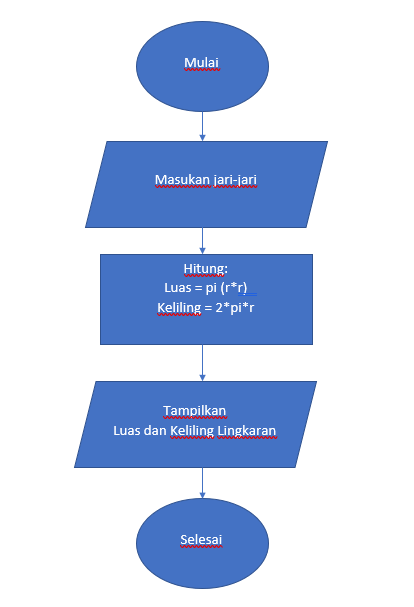
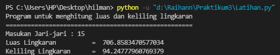

# Praktikum3
## Tugas Pertemuan 6 - Bahasa Pemrograman

### 1. File program menghitung luas dan keliling lingkaran
**Flowchart untuk menhitung luas dan keliling lingkaran**



```
 import math
 r = float(input("Masukan Jari-jari : "))

 luas = math.pi*(r*r)
 keliling = 2*math.pi*r
   
 print ("Luas Lingkaran \t\t= ",luas)
 print ("Keliling Lingkaran\t= ",keliling)
```
**Output:**



**Penjelasan:**

Program diatas saya mengimport modul math yang sudah di sediakan oleh python. Fungsinya supaya saya dapat menyertakan nilai phi yang sudah tersedia dalam modul tersebut dengan perintah math.pi jika kita coba mencetak fungsi tersebut maka akan menghasilkan nilai 3.14.
```
 import math
 print (math.pi)
```
Selanjutnya kita memerlukan nilai jari-jari (r) yang nantinya akan di masukan oleh pengguna pada layar console. Kita menggunakan fungsi input() yang nilainya di konversi ke tipe data float (bilangan riil). Ingat bahwa fungsi input() akan menganggap semua nilai inputan bertipe string, sehingga kita perlu melakukan konversi ke tipe yang diinginkan.

Ketika kita sudah mendapat nilai phi dan jari-jari selanjutnya kita bisa menghitung luas dan keliling sesuai dengan rumus-nya masing-masing (lihat pada baris ke 3 & 4).

Selanjutnya kita tampilkan hasilnya dengan fungsi print(). sintak \t merupakan karakter espace yang berfungsi untuk membuat tab. dalam kasus ini agar sejajar karakter sama dengan (=) nya.